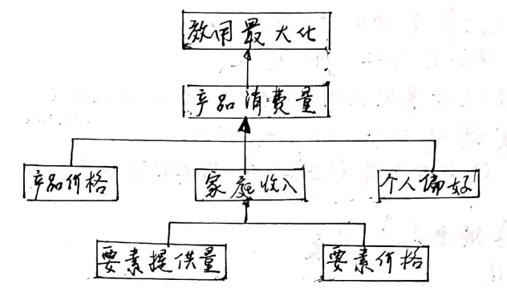

# 【微观经济学】第1章 导论

相关链接：
[微观经济学（西方经济学-上）教案-手写版-与高鸿业和马工程配套](https://b23.tv/fnDy4rR)
[《微观经济学》第一章“导论”手写教案](https://www.bilibili.com/read/cv11408924/)

[toc]

## 一、为什么学习经济学？

1. 理解所生活的世界
2. 更好地做出决策
3. 更好地理解经济政策的潜力与局限性

## 二、什么是市场经济？

市场在资源配置中发挥决定性作用
更好发挥政府作用

市场经济的基本理念：
	对个人自由的尊重
	对公众利益的重视

## 三、经济学的研究对象与具体研究领域

经济学（Economics）：
	研究对象：市场经济
	方法：
		科学：ics
		个人层面：微观经济学（Microeconomics）
		社会整体层面：宏观经济学（Macroeconomics）

三类物品：
	经济品：正的价格
	免费品：没有价格
	废品：负的价格

## 四、实证经济学与规范经济学

实证经济学：positive economics
规范经济学：normative economics

现代科学三原则：
	找出因果关系
	用逻辑体系说明因果关系
	用实验检验因果关系

实证经济学：使用现代科学三原则
	是什么、为什么、会如何

规范经济学：
	好不好、应当如何
	主观价值判断、伦理信条

## 五、微观经济学与宏观经济学

|          |      微观经济学      |      宏观经济学      |
| :------: | :------------------: | :------------------: |
| 研究领域 |      家庭、企业      |         政府         |
|  方法论  |       个人主义       |       整体主义       |
| 基本假设 |   经济人、充分就业   | 结构性假设、存在失业 |
| 分析工具 |     最优化、均衡     |     非均衡、均衡     |
| 研究中心 |       市场机制       |       政府作用       |
| 研究主题 |       资源配置       |       资源利用       |
| 理论依据 |     新古典经济学     |     凯恩斯经济学     |
| 研究重点 | 市场价格1 | 国民收入2 |

1 微观经济学：价格理论
2 宏观经济学：国民收入决定理论、货币理论

|            |        微观经济学        |  宏观经济学  |
| :--------: | :----------------------: | :----------: |
| 实证经济学 |       资源配置问题       | 资源利用问题 |
| 规范经济学 | 研究经济效率的福利经济学 | 宏观经济政策 |

## 六、经济模型

模型：
	市场需求模型
	市场供给模型
	市场均衡模型

变量：
	自变量、因变量
	内生变量、外生变量
		内生变量：未知变量
		外生变量：已知变量、常数
	存量、流量
		存量：时点
		流量：时段

方程：
	定义方程
	行为方程
	均衡方程

均衡分析：
	短期均衡、长期均衡
	一般均衡、局部均衡
		一般均衡（general equilibrium）：整个经济系统
		局部均衡（partial equilibrium）：单个经济主体、局部市场
	静态分析、比较静态分析、动态分析
		静态分析（static analysis）：分析一个均衡（看一张照片）
		比较静态分析（comparative analysis）：比较几个均衡（看几张照片）
		动态分析（dynamic analysis）：分析达到均衡的过程（看电影）

家庭经济行为模型：效用最大化

厂商经济行为模型：利润最大化

微观经济循环流量图
	两类市场主体：家庭、企业
	两类市场：产品与服务市场、生产要素市场

## 七、经济学中的常见谬误

后此谬误（post hoc fallacy）：误认为后此，所以因此
不能保持其他条件不变（failure to hold other things constant）
合成谬误（fallacy of composition）：误认为对局部成立的，对总体也成立

