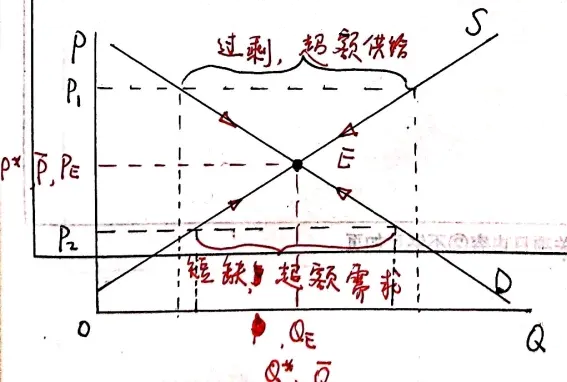

# 【微观经济学】第2章 需求、供给和均衡价格

[toc]

相关链接：
[《微观经济学》第二章“需求、供给和均衡价格”（上）手写教案](https://www.bilibili.com/read/cv11408965/)

## 基本假设

理性人、经济人：自私的人、自利的人

每一个经济个体都力图以最小代价实现最好结果（趋利避害）
	以最小代价实现利他行为或慈善行为也是自私

理性 ≠ 正确
非理性往往是无知

## 需求（Demand）

### 一、从支付意愿到需求

需求表：离散的

需求曲线：连续的
	下方 / 左侧：可实现
	上方 / 右侧：不可实现

### 二、需求的概念

需求函数：$Q^d = f(P)$
反需求函数 / 需求价格函数：$P = f^{-1}(Q^d)$

### 三、需求定律（the law of demand）

需求函数：$Q^d = f(P; I, P^c, P^s, T_a, P^e, ...)$ 
	背景因素：I、Pc、Ps、Ta、Pe、······
		I（income）：收入
		Pc（c：complement）：互补品的价格
		Ps（s：substitute）：替代品的价格
		Ta（taste）：消费者的口味、嗜好
		Pe（e：expectation）：消费者对该商品的价格预期

一元需求函数：$Q^d = f(P)$
	线性：$Q^d = \alpha - \beta P$（α，β > 0）
	非线性：$Q^d = A P^\varepsilon$（ε < 0）

### 四、需求变化

需求曲线：
	下移 / 左移：需求减少
	上移 / 右移：需求增加

$\frac{\partial Q^d}{\partial I} > 0$：正常品（normal goods）
$\frac{\partial Q^d}{\partial I} < 0$：劣等品 / 低档品（inferior goods）

$\frac{\partial Q_x^d}{\partial P_y} > 0$：替代品
$\frac{\partial Q_x^d}{\partial P_y} < 0$：互补品

### 五、从个人需求到市场需求

$Q = \sum\limits_{i=1}^n Q_i$

## 供给（Supply）

供给函数：$Q^s = f(P; P_f, P_m, T_e, t, P^o, ...)$
	背景因素：Pf、Pm、Te、t、Po、······
		Pf：生产要素的价格
		Pm：原材料的价格
		Te：技术水平
		t：税收
		Po：其他相关商品的价格

一元供给函数：$Q^s = f(P)$
	$Q^s = - \gamma  + \delta P$（γ，δ > 0）

供给曲线：
	上方 / 左侧：可实现
	下方 / 右侧：不可实现

供给定律：$\frac{\partial Q^s}{\partial P} > 0$

供给曲线：
	上移 / 左移：供给减少
	下移 / 右移：供给增加

**对比（我的总结）**

|          |  需求曲线   |  供给曲线   |
| :------: | :---------: | :---------: |
|  可实现  | 下方 / 左侧 | 上方 / 左侧 |
| 不可实现 | 上方 / 右侧 | 下方 / 右侧 |
|   减少   | 下移 / 左移 | 上移 / 左移 |
|   增加   | 上移 / 右移 | 下移 / 右移 |

$Q^s = \sum\limits_{i=1}^n Q_i^s$

## 市场均衡

过剩（surplus）：超额供给（Qd < Qs）
短缺（shortage）：超额需求（Qd > Qs）
均衡：市场出清（Qd = Qs）

均衡的变化：比较静态分析

